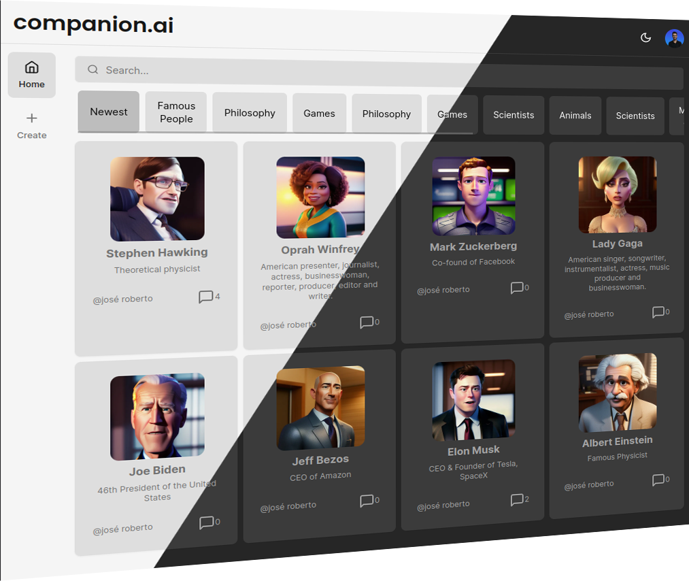

# SaaS AI Platform with Next.js 13, React, Tailwind, Prisma, MySQL, OpenAI

<p align="center">
  
  <br />
</p>


Features:

- Tailwind design
- Tailwind animations and effects
- Full responsiveness
- Clerk Authentication (Email, Google, 9+ Social Logins)
- Client form validation and handling using react-hook-form
- Server error handling using react-toast
- Conversation Generation Tool (Open AI)
- Page loading state
- Folder structure in Next 13 App Router

### Prerequisites

**Node version 18.x.x**

### Cloning the repository

```shell
git clone https://github.com/Jrm1992/ai-companion
```

### Install packages

```shell
npm i
```

### Instance Docker MySQL Database

```shell
docker compose up -d
```

### Setup .env file


```js
NEXT_PUBLIC_CLERK_PUBLISHABLE_KEY=
CLERK_SECRET_KEY=

NEXT_PUBLIC_CLERK_SIGN_IN_URL=/sign-in
NEXT_PUBLIC_CLERK_SIGN_UP_URL=/sign-up
NEXT_PUBLIC_CLERK_AFTER_SIGN_IN_URL=/dashboard
NEXT_PUBLIC_CLERK_AFTER_SIGN_UP_URL=/dashboard

OPENAI_API_KEY=
REPLICATE_API_TOKEN=

PINECONE_API_KEY=
PINECONE_ENVIRONMENT=
PINECONE_INDEX=

UPSTASH_REDIS_REST_URL=
UPSTASH_REDIS_REST_TOKEN=

NEXT_PUBLIC_CLOUDINARY_CLOUD_NAME=

DATABASE_URL=

STRIPE_API_KEY=
STRIPE_WEBHOOK_SECRET=

NEXT_PUBLIC_APP_URL="http://localhost:3000"
```

### Setup Prisma

Add MySQL Database (I used PlanetScale)

```shell
npx prisma db push

```

Seed categories:
```shell
npx prisma db seed
```

### Start the app

```shell
npm run dev
```

## Available commands

Running commands with npm `npm run [command]`

| command         | description                              |
| :-------------- | :--------------------------------------- |
| `dev`           | Starts a development instance of the app |
